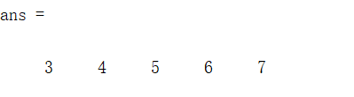
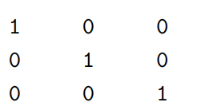
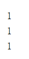

# 直接建立
A=[3 2
      1  3]]
A=[3,2
      1,3]]
A=[3,2;1,3]
换行可以用;替代
同行到下一个可以用,替代
# 快速建立
## 冒号
最小数:步长（步长为1时可以省略）:最大数（不一定达到）
3:1:7

## linspace
linspace(最小数,最大数,步数)
linspace(3,6,6)

# 访问
A=[1 2 3;3 4 5;2 2 1]
A(2:3,2:3)
ans=4 5
        2  1
A(:,2:3)（取所有行，从第二列取到第三列）
更改
A(3,1)=3
# 对角线
## 找矩阵的对角线
diag(A)
## 创造对角线
 diag(v,k) 将向量 `v` 的元素放置在第 `k` 条对角线上。`k=0` 表示主对角线，`k>0` 位于主对角线上方，`k<0` 位于主对角线下方
 
 # 创造特殊矩阵
 ## 单位矩阵
 eye(3)
 
 ## 全是1的矩阵
 ones(m,n)创造一个m行n列的全是1的矩阵（只有一个参量的时候认为是创造一个正方形）
 ones(3,1)
 
 # 随机矩阵
 (0,1)之间的随机数 x=rand
 rand(m)m级矩阵
 rand(m,n)m行n列的矩阵
 ceil(m\*x)在[1,m]中随机取一个整数
 randi(m)在1到m之间创造一个随机整数
 大概是这样的
 # 运算符
 ## 矩阵运算
 在MATLAB中，有两种矩阵除法运算:右除/和左除\。如果A矩阵是非奇异方阵，则B/A等效于B* inv(A), A\B等效于inv (A) \*B。
 （可以认为除号下面的举证作为被除数，不过注意一下顺序$A^{-1}B$和$BA^{-1}$的区别）
 inv(A)取A得逆
 rank(A)取A得秩
 transpose(A)取转置
 A‘ 转置后对每个数取共轭
 det(A)取行列式
 ## 点运算
 点运算符: .\*、./、. \和. ^ 。两矩阵进行点运算是指它们的对应元素进行相关运算，要求两矩阵同型。
 .'只取转置
 ## 矩阵合并
 A=[A matrix2]
 # 复数
 ## 共轭复数
 conj(u)取共轭
 ## 取实数部分
 real(V)
 ## 取复数部分
 imag(V)
 # 内置函数
 exp(a)  $e^a$
 poly(X)以X元素为根的多项式方程的系数
 roots(x)以x为系数的多项式方程的跟
 hib(n)产生n级的希尔伯特矩阵
    The  so-called condition number, κ(A), is the ratio between the largest singular value to the smallest  
singular value of A. If κ(A) is very large, then the linear system Ax = b is ill-conditioned, and  
accurate solutions are diffcult or even impossible to get. For this Hilbert matrix, the condition  
number is
   Here rcond is the reciprocal condition estimator. It is some approximation to 1/κ(A). It is not  
exactly 1/κ(A), because κ(A) is more expensive to calculate
# 特征值
A=[1 2 3;4 5 6;3 1 2]
eig(A)求A的特征值
[V,D]=eig(A)此时V是特征向量，D是特征值
要注意的是，这里求出来的特征值是并未经过排序的（可以理解为大小是随机排列的）
[ss,II]=sort(s)
对s进行排序，ss是排序后形成的向量，II是对应元素在原向量中的下标
如s=[4;6;5]
[ss,II]=sort(s)
VV=V(,II)根据特征值从小到大重排对应的特征向量

我们常用[ss,II]=sort(diag(D))对特征值进行排序（D为特征值形成的对角向量）
 # 补充

