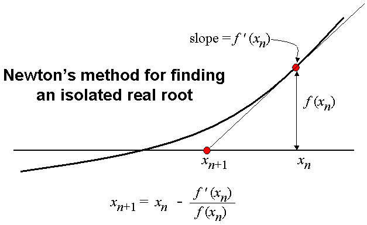
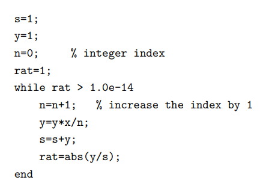

# 误差
$\epsilon=|\frac{\Delta x}{x_i}|=|\frac{x_{i+1}-x_i}{x_{i+1}}|$
当$\epsilon <= tiny$（我们通常让tiny=$1*10^{-10}$，也就是tiny=1.0e-10）时，我们认为这个解很好了
# newton's method
$x_{i+1}=x_i-\frac{f(x_i)}{f'(x_i)}$

# 泰勒方法改进
用relative error较小来进行控制，而不是用次数n的大小

# scant method
$$\begin{aligned}
p_{n+1} &=p_{n}-f\left(p_{n}\right) /\left(\frac{f\left(p_{n}\right)-f\left(p_{n-1}\right)}{p_{n}-p_{n-1}}\right) \\
&=\frac{p_{n-1} f\left(p_{n}\right)-p_{n} f\left(p_{n-1}\right)}{f\left(p_{n}\right)-f\left(p_{n-1}\right)}
\end{aligned}$$

# 找零点
x=fzero(fun,x0)
x0是初始值
fun要用@包装一下成为闭包，否则是执行这个函数而非输入参数后输出

# 找最小值
fminbnd(f,0,2)
-fminbnd可以帮忙找最大值

# 多项式
poly(rs)生成以rs为跟的多项式的系数
roots(rs)生成以rs为 系数的多项式的根

