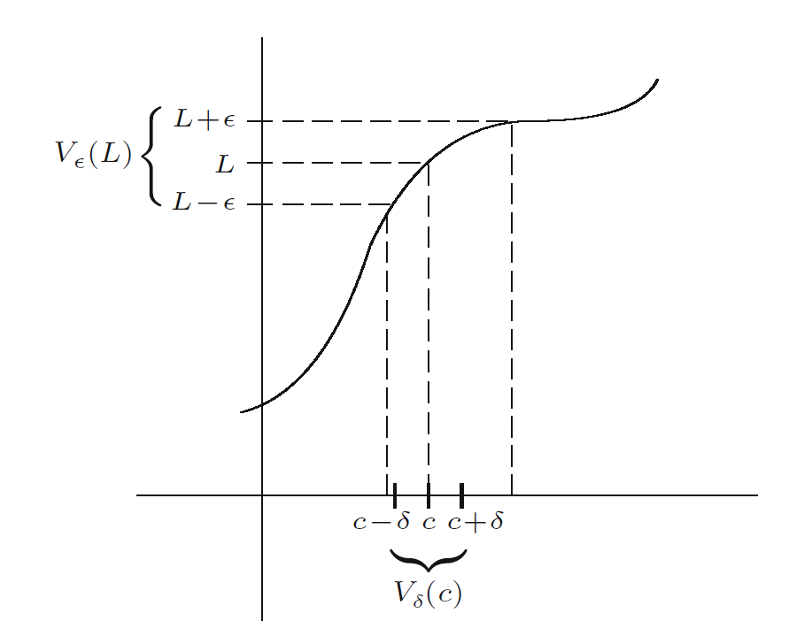

#! https://zhuanlan.zhihu.com/p/518317663
# 数学中的迷思
我和不少的同学有进行过交流，不少的人都反馈说，他们觉得数学很难，很抽象，十分难以理解，主要体现在上课听不懂，下课不会做，然后张着纯真的大眼睛，看着台上的数学学霸们侃侃而谈，心生佩服。
我在大致交流后，发现了他们的一些问题，同时在这里我也说一说我的一个个人解决办法

# 数学太抽象
很多人都跟我提起过数学数学太抽象，我现在看着极限delta-epsilon为例子（实际上这个也是很多人不理解的内容）
$$若对于\forall \epsilon >0,\exists \delta>0,使得,对于\forall x满足 0<|x-a|<\delta,|f(x)-b|<\epsilon，则称\lim \limits_{x \rightarrow a}f(x)=b$$
许多人看着这个定义，百思不得其解，这个delta和epsilon到底是从哪个石头里蹦出来的，以及为什么一会儿存在，一会儿任意。我这边提供几个解决的路径吧
## 了解数学概念
我觉得对于数学概念的一个定义，我们并不需要第一时间去理解他的精准的定义（就是上面balabla又臭又长的那个句子，首先我们要有一个大概直观的感觉，在于这个定义**有什么用**，或者说定义出来的目的是什么，对此我觉得两种办法比较有效
### 看数学史
了解数学史就可以知道一个数学的定义他的发展，如果你从微积分的时代看到现在的微积分定义，你会看到牛顿，莱布尼兹是如何定义微分，他们的定义都是特别简单，好理解的，然后随着时代的发展，公式的定义变得越发的复杂，也变得越发的严谨，也更加的让人摸不着头脑。实际上我认为，你学不懂微积分才是正常的事情，牛顿莱布尼兹发明微积分已经至少350年了，你觉得你比牛顿和莱布尼茨聪明吗，你凭什么能在 初学的时候一下子明白人类发展了350年的内容。知道了数学历史才能知道你学这些内容的意义在哪里，就像矩阵的定义是为了解决方程组，再例如历史的发展是从积分发展到微分再发展到实数理论的，也就是说我们的教材一开始讲实数理论的目的，实际上是为了讲后续的微分，而讲后续的微分，是为了讲紧接的积分的。你不了解这些，你当然觉得数学跟石头里蹦出来的一样。别扯淡，你见过哪个小孩一出生就会写综述的。（在我后续的每章节的笔记前，都会附带这么一章序言讲讲主要知识点的历史的）
#### 画图
实际上在这方面我更推荐你去看视频，因为在不了解这个概念的时候，你自己也画不出来什么图，我比较推荐3blue1brown的入门视频的，讲的都很浅，一下子就能明白概念如何在现实中如何应用的（后续我应该会整理资源库的）
### 看例子
实际上这个方法应用的很少，只适用于一些非常入门的知识的学习。如果你看不懂这个概念，你可以直接跳过定义部分去看例题，大致感受一下这个定义是怎么用的
### 补充：换个教材（多个教材）
实际上有的时候学习不是你的问题，有可能是你选的教科书的问题（资源库到时候会精选一下比较推荐的教材），有些教材实在是太恶心人了，还不如不看，看了还增加负面影响。他们写书就是纯纯的上帝视角，写完了就一走了事，不管读者死活的。另外每本书他的优点和缺点都是有的，你也可以多拿几本教材互相翻看
## 剖析数学定义语言
在了解了数学数学定义大概后，我们就要深入的去了解为什么数学是这么定义的，为什么他能定义的如此抽象
### 抬杠法
所谓抬杠，就是你大约了解了这个数学概念后，尝试自己去定义一下，而不要去看教材。你可以把自己弄出来的定义和书上的定义进行比对，看看有什么区别，然后找几个例子看看能不能反驳书上的定义，从中找不同。当然更快的办法是把定义的某个条件遮掉，看看如果没有这个条件，你映像中的那个概念他是否能接着成立。在反复遮盖以后你就知道他的精妙之处

### 离散举例法
所谓离散举例法，就是你把题目中的条件进行任意的赋值，且多次赋值，观察最后的结果，从中感受内容的含义，通常来说我们也把他用在离散的情况，比如组合数学，比如和整数有关的题目上
比如为什么有n个节点,n-1条边的的图就是树。你可以让n=5,然后你画个线段，很显然对于线段而言，很显然就是n个节点，n-1条边的，然后你再画个树，你数一下，发现正好4条边，然后你再加一个点，然后发现诶，正好是5条边。你会发现加一个点，正好是加一个边，然后2个点才能有一个边，所以是n-1条边。
### 画图剖析
画图是一种更加高阶也更能帮助你理解的办法，这种办法经常用在和实数，集合相关的定理上
在这里我使用《undestanding analysis》上面的一张图

我们顺着定义读这个图
>对于任意$\epsilon>0$，存在$\delta>0$

这里没有内容
>使得对于$\forall x$，|x-a|<$\delta$

(图上面的c就是原本定义中的a)那这时候我们就会发现x在图中标注的$V_{\delta}(c)$中，
>则|f(x)-b|<$\epsilon$

(图中的L就是定义中的b)这时候我们就会发现，无论x在$V_{\delta}(c)$中怎么动，f(x)都始终困在$V_{\epsilon}(L)$中，你就能大概理解出极限是什么了——就是对于无论多小的$\epsilon$，都有一个区域让f(x)和L的距离是小于$\epsilon$的，由此我们了解为什么这么定义能够表示趋向于，因为趋向于就可以理解为距离越来越小。
## 学习中的错误
### 记忆硬背
我特别特别不推荐在数学中死记硬背，理由很简单——数学的知识结构性太强了。不理解的记忆一定不能长久，如果你这个模块是死记硬背的，那么其他和这个模块的的相关知识，会因为你这个模块的忘记而出现问题，就像多米诺骨牌一样
## 其他建议
### 多学
很多知识他之所以难，可能是因为他从其他地方改编了一下题目然后给你做，比如中值定理的题目通常就是微分方程的题目里面改编过来的。你没学微分方程你当然搞不懂为什么老师要这么解题